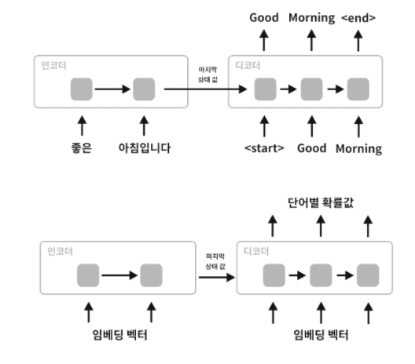

### 챗봇 머신러닝 요약
- 신경망을 사용하여 자연어처리를 하려면 컴퓨터가 이해할 수 있는 형식으로 변환해야 함
- 가장 쉬운 방법은 One-Hot Encoding을 사용하는 것
- 전체 단어의 수 만큼 벡터의 차원을 만들고 각 단어마다 하나의 차원에 대입

#### 워드 임베딩
1. 0, 1 과 같이 두개의 값이 아니라 0 ~ 1 사이의 벡터값을 가짐.
2. 하나의 단어마다 벡터의 차원을 모두 사용하기에 벡터의 크기를 작게 할 수 있음
3. 비슷한 단어는 벡터의 값이 유사하기 때문에 학습이 더 잘되는 장점이 있음
4. 대표적으로 Word2Vec가 있는데 신경망을 통해 문서 데이터에서 각 단어의 벡터를 학습 가능

- [참고 - Word2Vec](https://dreamgonfly.github.io/blog/word2vec-explained/)
- [참고 - 단어 간 유사도 파악 방법](https://brunch.co.kr/@kakao-it/189)
- [참고 - 자연어 기계학습의 혁명적 진화 - Word2Vec에 대하여](https://www.moreagile.net/2014/11/word2vec.html)

#### 순환 싱경망 RNN(Recurrent Neural Networks)
1. 일반적인 신경망은 피드포워드(feedforward) 방식. 입력에서 출력까지 한쪽 방향만 흐른다.
2. 출력이 다시 입력으로 들어가는것이 특징
3. 이전 출력이 다음번 출력에 영향을 줌
4. 주식, 시계열 데이터, 자연어와 같이 연속적인 상관관계가 있는 분야에서 사용
5. 단 입력 데이터 사이의 거리가 멀어 질 수록 의미를 기억하지 못함
6. 이런 문제를 보완한 것이 LSTM(Long Short Term Memory Networks)

- [참고 - RNN Tutorial](http://aikorea.org/blog/rnn-tutorial-1/)
- [참고 - LSTM 소개](https://brunch.co.kr/@chris-song/9)

#### Seq2Seq(Sequence-to-Sequence)
1. 문장을 그대로 입력 받아서 바로 문장이 출력되도록 하는 방식
2. Encoder와 Decoder 두개의 RNN을 사용하여 구현
3. 단 피자를 주문하거나 물건을 구입하는 등 여러가지 명령어를 수행하는데는 아직 적합하지않음

- [참고 - 문장을 학습하는 딥러닝 RNN의 Seq2Seq 모델 설명](http://aidev.co.kr/chatbotdeeplearning/2273)
- [참고 - 골빈해커님의 Seq2Seq 챗봇](https://github.com/golbin/TensorFlow-Tutorials/tree/master/10%20-%20RNN/ChatBot)

#### Char-CNN 문장의도 파악
1. 보통 챗봇에서 많이 사용하는 방법은 의도와 객체 파악
2. CNN은 대표적으로 이미지 분류에 높은 성능을 보이지만 캐릭터 문자를 처리하는데도 유용
3. 문장을 벡터로 변환하고 특징을 추출한 다음 어떤 의도인지 분류
4. 딥러닝의 장점은 규칙기반과 다르게 복잡한 구문분석 없이도 문장의 의미를 보다 정확하게 파악 가능.

- [참고 - 합성곱 신경망(CNN) 딥러닝을 이용한 한국어 문장 분류](https://docs.likejazz.com/cnn-text-classification-tf/)
- [참고 - CNN으로 문장 분류하기](https://ratsgo.github.io/natural%20language%20processing/2017/03/19/CNN/)
- [참고 - Python과 Tensorflow를 활용한 AI Chatbot 개발 및 실무 적용](https://www.slideshare.net/healess/python-tensorflow-ai-chatbot)
- [참고 - 딥러닝 기반 자연어처리 기법의 최근 연구 동향](https://ratsgo.github.io/natural%20language%20processing/2017/08/16/deepNLP/)

#### RNN으로 개체명 인식 학습
1. NER(Named Entity Recognition)은 문장에서 개체명을 인식하는 것
2. RNN은 문장의 순서에 따라 결과가 다르게 나옴(예. 애플(음식) 파이 와 애플(회사) 컴퓨터)

[출처 - 딥러닝을 사용한 챗봇 개발방법 정리](http://aidev.co.kr/chatbotdeeplearning/3187)

---
### Seq2Seq

- 문장을 입력받아 문장을 출력한다. 
- 인코더와 디코더로 이루어져 있다.
- 인코더에서는 전체 입력정보를  순환적으로 처리하여(RNN, LSTM 사용) 히든 스테이트와 셀 스테이트, 즉 상태 값을 저장한다.
- 디코더에서는 해당 정보를 기반으로 OUTPUT을 하나씩 출력한다.
- 인코더로부터 받은 상태값들을 기반으로 <START>을 디코더 첫 입력값으로 입력한다.
- 반드시 <START>가 아니어도 시작을 알리기에 보편적으로 사용할 수 있는, 일반적이지 않아 다른 문자열과 혼동될 문제가 없는 문자열이면 충분하다.
- 디코더에서는 상태값들을(히든 스테이트, 셀 스테이트) 출력하게 된다.
- <START>와 인코더 상태값을 입력했을 때 출력된 출력값을 다시 입력으로 사용한다.
- 이전 상태의 상태값들을 기반으로 다시 신경망을 통과한다.
- <END> 결과가 나오면 순환을 종료한다.
- <START>와 <END>는 모델 학습 수행시 결정해주는 것이다. 다른 구별 문자를 넣어줘도 크게 문제될 것은 없다.
- 실질적으로는 위의 두번째 그림처럼 임베딩된 데이터가 들어가고 소프트맥스 함수로 단어별 확률값이 출력될 것이다.

[참고 - Seq2Seq](https://inuplace.tistory.com/580)