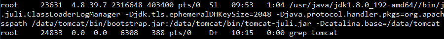
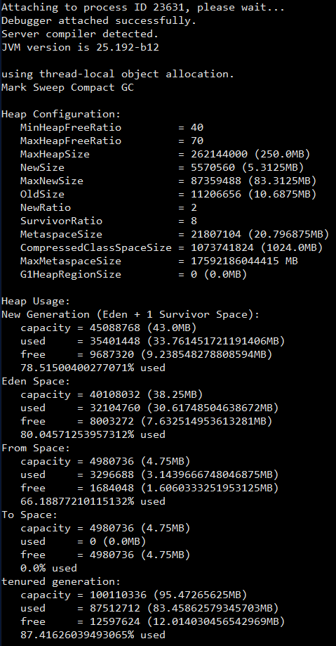
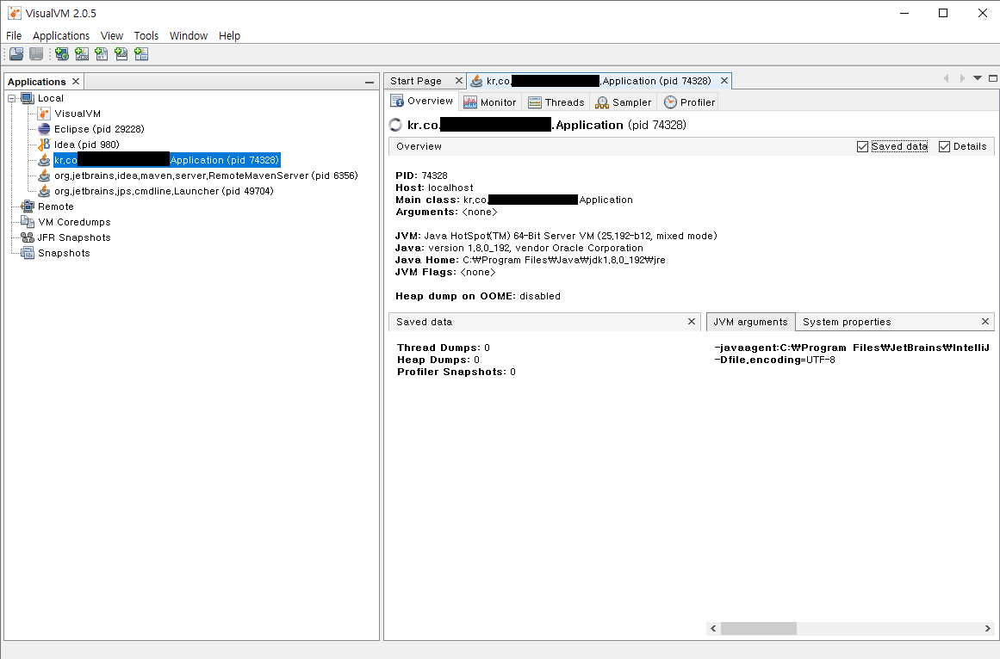

#### 톰캣에서 사용중인 Heap 사이즈 확인
- ps -au|grep tomcat 명령어로 톰캣의 정보를 확인한다.

- jmap -heap [PID] 를 입력하여 JAVA의 힙 메모리 설정을 확인한다.
  (예. tomcat의 PID가 23631 경우 명령어는 jmap -heap 23631)
- MaxHeapSize 를 확인한다. 현재 최대로 설정되어 있는 힙사이즈는 250MB 이다.


#### JAVA Heap 사이즈 초기 설정 규칙

```
  Heap sizes 규칙
  Initial heap size of 1/64 of physical memory up to 1Gbyte
  Maximum heap size of 1/4 of physical memory up to 1Gbyte
  ```

&nbsp;&nbsp;나의 가상머신은 1GB 이므로 최소 Heap 사이즈는 16MB 이고 최대 Heap 사이즈는 250MB 이다.

#### JVM 모니터링 도구 VisualVM
NetBeans 플랫폼을 기반으로 개발된 VisualVM은 JVM을 실시간으로 모니터링하는 GUI 도구이다. 그 외에도 Heap Dump, Thread Dump도 할 수 있으며 여러개의 VM을 동시에 모니터링 및 프로파일링 할 수 있다.

##### 사용방법은

1. [VisualVM 다운로드](https://visualvm.github.io/download.html) 에서 다운로드를 한다.
2. 압축을 해제한 뒤 bin 폴더로 이동 한 뒤 visualvm.exe를 실행 한다.
3. Applications 탭에서 모니터링하고자 하는 목록을 클릭하면 오른쪽(모니터링, 스레드, 샘플러, 프로피일 탭)에서 확인할 수 있다.


##### 각 탭에 대한 설명
- Overview: 사용 옵션 및 자바 버전와 같은 시스템 정보 확인가능하다.
- Monitor: CPU, Memory, Classes, Threads 등을 볼 수 있다.
- Threads: 현재 Threads의 상태를 확인 가능하다.
- Sampler: CPU, Memory를 샘플링 할 수 있다. 즉, JVM의 일정 주기로 스레드 덤프를 통해서 성능을 측정하고 성능 측정에 영향을 거의 주지 않는다. 하지만 일정 주기로 스레드 덤프가 호출 되기 때문에 호출 횟수를 잃어버리는 경우가 생겨 정확하지 않다.
- Profiler: CPU, Memory 프로파일링을 할 수 있다. 즉, 어플리케이션 전체 혹은 몇몇 클래스의 성능을 측정 할 수 있고 알고리즘 최적화나 호출 횟수 측정하기에 용이하다.그리고 Profiler 에 의해 자동적으로 생성된 코드가 성능 측정에 어느정도 영향을 줄 수 있다.

#### 패턴
- Table Data GateWay 패턴: 테이블 별로 하나의 DAO를 만든다.
- Separated Interface 패턴: DIP(Dependency Inversion Principle)에 기반하여 인터페이스와 구현부 사이의 계층을 분리하는 패턴
- Transition Script 패턴: 하나의 트랜잭션으로 구성된 로직을 단일 함수 또는 단일 스크립트에서 처리하는 구조이다.

#### DAO vs Repository
- DAO
  - Transaction Script 패턴과 함께 사용된다.
  - 퍼시스턴스 레이어에 속한다.
  - 데이터베이스의 CRUD 쿼리와 1:1 매칭되는 세밀한 단위의 오퍼레이션을 제공한다.
  - Dao에서 제공하는 오퍼레이션이 Repository가 제공하는 오퍼레이션보다 더 세밀하다.
  - 데이터베이스 뿐만 아니라 B2B, LDAP, 메인 프레임, 레거시 시스템등 다양한 종류의 외부 시스템과의 사옿작요을 캡슐화하기 위해 사용 될 수 있다.
- Repository
  - Domain Model 패턴과 함께 사용 된다.
  - 도메인 레이어에 속한다.
  - 메모리에 로드된 객체 컬렉션에 대한 집합 처리를 위한 인터페이스를 제공한다.
  - Repository에서 제공하는 하나의 오퍼레이션이 DAO의 여러 오퍼레이션에 매핑되는 것이 일반적이다.
  - 하나의 Repository 내부에서 다수의 Dao를 호출하는 방식으로 구현할 수 있다.
  - 외부 시스템과의 상호작용은 별도의 Service 가 담당한다.

#### DDD Start
- 도메인은 여러개의 하위 도메인을 가질 수 있다. 
- 도메인에 따라 용어의 의미가 결정된다.
- 여러 하위도메인을 하나의 다이어그램에 모델링하면 안된다. 이는 도메인을 이해하는데 방해가 된다.
- 도메인 모델 패턴
  |계층|설명|
  |----|----|
  |표현|사용자의 요청 처리 및 사용자에게 정보를 보여준다.|
  |응용|사용자가 요청한 기능을 실행한다. 업무로직을 직접 구현하지 않고 도메인 계층을 조합해서 기능을 실행한다.|
  |도메인|시스템이 제공할 도메인 규칙을 구현한다.|
  |인프라스트럭처|데이터베이스나 메시징 시스템과 같은 외부 시스템과의 연동을 처리한다.|

- 개념 모델: 순수하게 문제를 분석한 결과물이다. 이 모델은 데이터베이스, 트랜잭션 처리, 성능, 구현 기술등등과 같은 것을 고려하지 않기 때문에 실제 코드를 작성할 때는 개념 모델을 있는 그대로 사용할 수 없다. 그래서 개념 모델을 구현 가능한 형태의 모델로 전황하는 과정이 필요하다.
- 구현 모델: 구현하는 과정에서 개념 모델을 개발하면서 점차 발전해 나가는 모델의 형태(?)

- 도메인을 모델링할 때 기본이 되는 작업은 모델을 구성하는 핵심 구성요소, 규칙 기능을 찾는 것이다.
- 엔티티: 식별자를 갖는 객체이다. 식별자의 종류에는 특정 규칙에 따라 생성, UUID, 값을 직접 입력, 일련번호 사용(시퀀스나 DB의 자동증가 컬럼) 등이 있다.
- 밸류타입: 개념적을 완전한 하나를 표현 할 때 사용한다. 그리고 불변으로 구현하는 것을 권장한다.
- 도메인 모델에 set 메서드 넣지 않기.
- DIP(Dependency Inversion Principle, 의존 역전 원칙): 고수준의 모듈의 테스트를 하려면 저수준의 모듈에 의존해야 되는데 이렇게 될 경우 구현변경과 테스트의 어려움이 있다. 이를 해결하기위해 저수준의 모듈이 고수준의 모듈을 의존하도록 한다.
- 애그리거트(AGGREGATE): 애그리거트는 관련된 엔티티와 밸류 객체를 개념적으로 하나로 묶은 것이다. 도메인 모델에서 전체 구조를 이해하는데 도움이 된다.
- 리포지터리(REPOSITORY): 도메인 모델의 영속성을 처리한다.
- 도메인 서비스(DOMAIN SERVICE): 특정 엔티티에 속하지 않은 도메인 로직을 제공한다.
- 도메인 모델의 엔티티: 데이터와 함께 도메인 기능을 함께 제공한다. 예를 들어, 주문을 표현하는 엔티티는 주문과 관련된 데이터 뿐만 아니라 배송지 주소 변경을 위한 기능도 함께 제공한다. 그리고 두 개 이상의 데이터가 개념적으로 하나인 경우 밸류 타입을 이용해서 표현 할 수 있다.
- DB의 엔티티: 밸류 타입을 제대로 표현하기 힘들다. 단순하게 데이터를 담고 있다.
- 애그리거트
  - 애그리거트 루트: 애그리커드에 속한 모든 객체가 일관된 상태를 유지하려면 애그리커트 전체를 관리 할 주체가 필요한데 이 책임을 지는 것이 애그리거트의 루트 엔티티이다.
  - 애그리거트와 리포지터리: 에그리거트 루트안에 속하는 기능들은 오직 에그리거트 루트를 위한 리포지터리만 존재해야 한다. 애그리거트는 개념적으로 하나이므로 리포지터리는 애그리거트 전체를 저장소에 영속화 해야 한다.
  - 애그리거트에서 루트 엔티티를 뺀 나머지 구성요소는 대부분 벨류이다. 루트 엔티티 외에 또 ㅏㄷ른 엔티티가 있다면 진짜 엔티티인지 의심해봐야 한다. 단지 별도 테이블에 데이터를 저장한다고 해서 엔티티인 것은 아니다.
  - 애그리거트에 속한 객체가 밸류인지 엔티티인지 구분하는 방법은 고유 식별자를 갖는지 여부를 확인한다. 별도 테이블로 저장되고 테이블에 PK가 있다고 해서 테이블과 매핑되는 애그리거트 구성요소가 고유 식별자를 갖는 것은 아니다.
