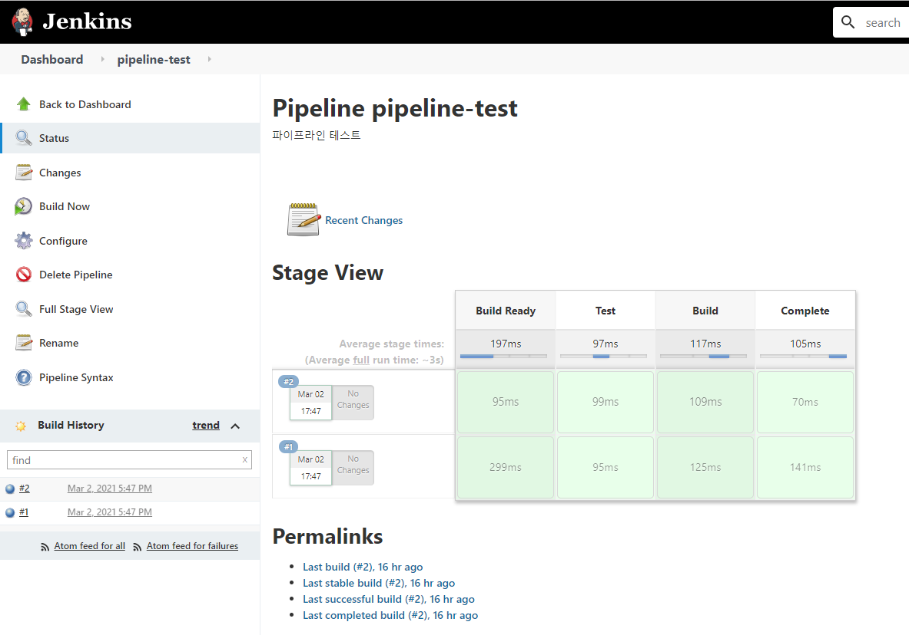
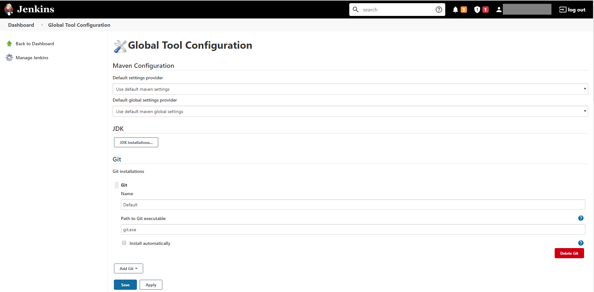
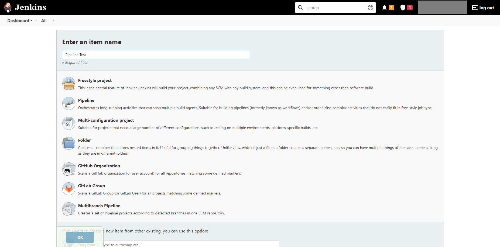
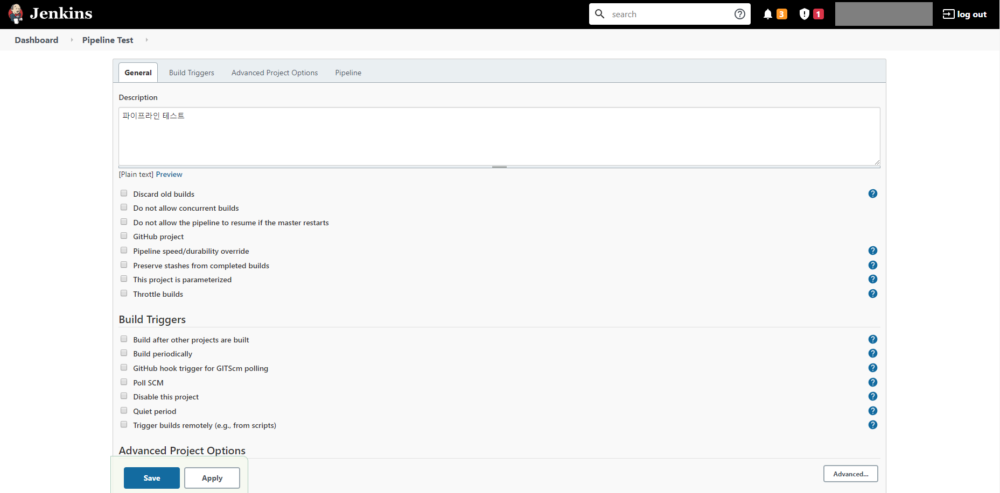
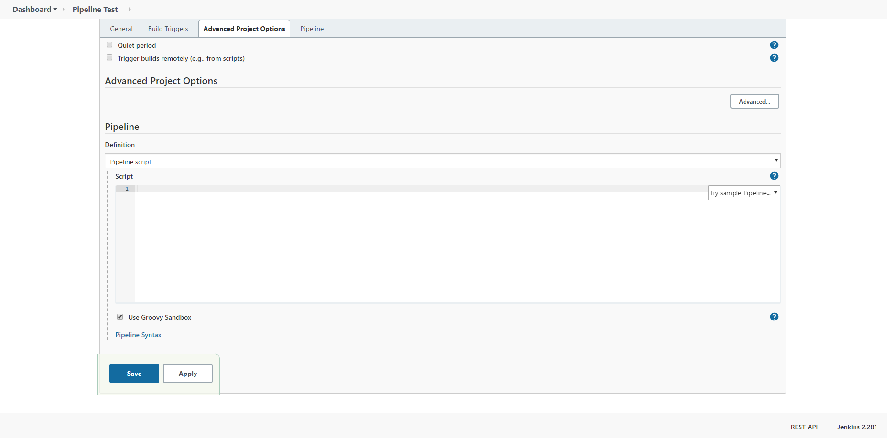
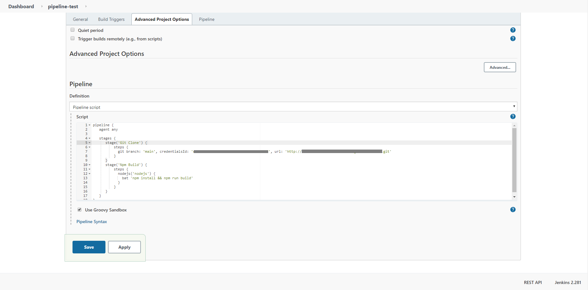
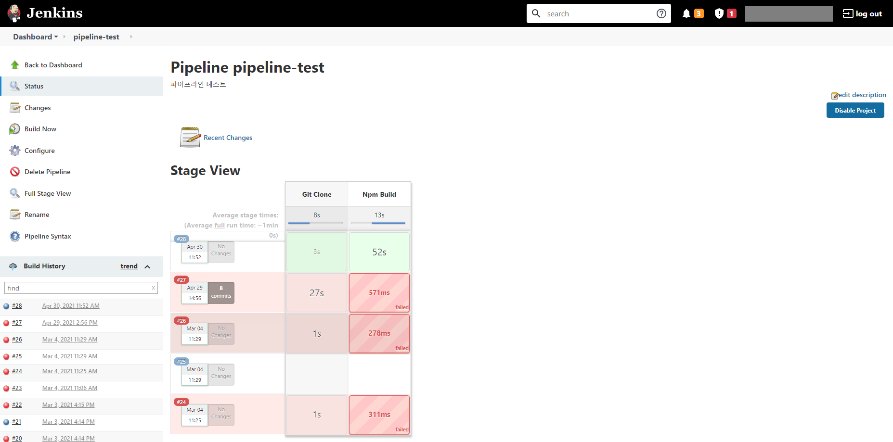

#### Pipeline
  - 파이프라인을 구성하여 젠킨스의 워크플로우를 구성할 수 있다.
  - Pipeline을 구성하는 문법에는 scripted 와 Declarative 문법 2가지가 존재한다.
    - [scripted 공식 문서](https://www.jenkins.io/doc/book/pipeline/syntax/#scripted-pipeline)
    - [Declarative 공식 문서](https://www.jenkins.io/doc/book/pipeline/syntax/#declarative-pipeline)
  - 기본적인 Pipeline script 예시
  
  ```
    pipeline {
      agent any

      stages {
          stage('Build Ready') {
            steps {
                echo 'Build Ready'
            }
          }
          stage('Test') {
              steps {
                  echo 'Testing...'
              }
          }
          stage('Build') {
              steps {
                  echo 'Building...'
              }
          }
          stage('Complete') {
              steps {
                  echo 'Complete!'
              }
          }
      }
    }
  ```

  - Pipelin 빌드 후 젠킨스 화면
  

#### 파이프라인으로 Node 프로젝트 빌드하기
1. Jenkins 글로벌 설정에서 Git, Node 설정을 진행한다.


2. Jenkins 대시보드에서 새로운 아이템을 생성한다.


3. 프로젝트에대한 설명을 입력 후 맨 아래로 스크롤한다.


4. 아래의 입력상자에서 파이프 라인을 작성한다. 
작성시 파이프라인 Syntax 가 궁금하다면 맨 아래의 Pipeline Syntax 버튼을 클릭하면 된다. 그러면 기본적인 Syntax를 확인 할 수 있다.


5. 아래와 같이 파이프라인을 작성한다.

```
pipeline {
   agent any

   stages {
      stage('Git Clone') {
          steps {
            git branch: '브런치명', credentialsId: 'Git 인증 키', url: 'Git 주소'  
          }
      }
      stage('Npm Build') {
          steps {
            nodejs('nodejs') {
              bat 'npm install && npm run build'
            }
          }
      }
   }
}
```



6. 프로젝트의 대시보드로 돌아와서 Build Now 를 클릭하면 빌드 후 성공된 모습을 볼 수 있다.
